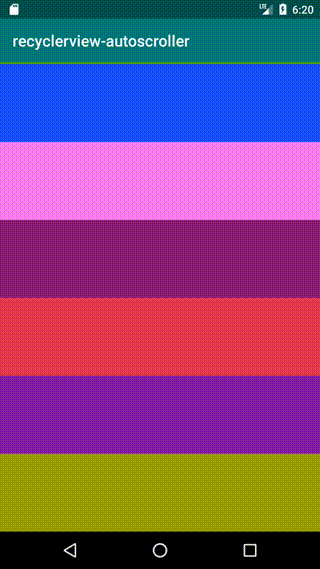

# recyclerview-autoscroller

recyclerview-autoscroll is a simple library to auto scroll RecyclerView.

 

## Try it out:

```gradle
implementation "com.m4kvn:recyclerview-autoscroller:0.1.0"
```

### Get started

When use in activity and fragment, call `start` in onResume and call `stop` in onStop.

```kotlin
val autoScroller = RecyclerViewAutoScroller(1000L, 0)

override fun onResume() {
    super.onResume()
    autoScroller.start(recyclerView)
}

override fun onPause() {
    super.onPause()
    autoScroller.stop()
}
```
